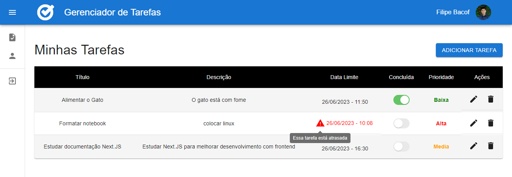
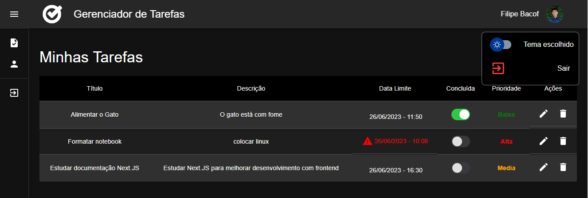
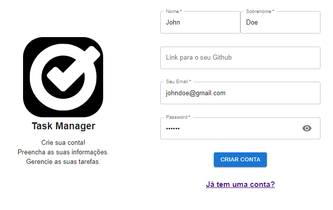
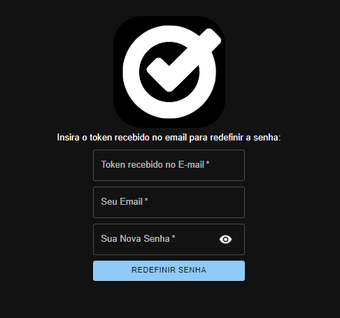

# Desafio Técnico Olhar 180

#### [Front-End Repositório](https://github.com/Filipe-Bacof/olhar180-frontend-desafio)
#### [Front-End Deploy](https://olhar180-frontend-desafio.vercel.app)
<div style="justify-content: space-around;">
  
  
  
  
  
</div>

#### [Back-End Repositório](https://github.com/Filipe-Bacof/olhar180-backend-desafio)
#### [Back-End Deploy](https://olhar180-backend-desafio-production.up.railway.app)
<div style="justify-content: space-around;">
  
  
  
  
  
</div>

### Aplicações desenvolvidas nos dias 24, 25, 26 de Junho de 2023.
## [Ver Portifólio Filipe Bacof](https://portifolio-filipe-bacof.vercel.app/)

## Prints do Projeto:
- Tema Claro


- Tema Escuro


- Formulário de Cadastro (tema claro)


- Formulário para gerar nova senha (tema escuro)


## Ferramentas Utilizadas
Aqui estão algumas informações sobre as ferramentas utilizadas neste projeto:
- `Arquitetura Back-End`: O projeto segue o paradigma de Programação Orientada a Objetos (POO) e utiliza o design pattern **Singleton**.
- `Biblioteca de Front-End`: Foi escolhido o **Material UI** para modelar o front-end. Essa biblioteca oferece uma variedade de componentes prontos e estilizados, o que acelera significativamente o processo de desenvolvimento.
- `Banco de Dados`: O banco de dados utilizado é o **PostgreSQL**. No entanto, em vez de utilizar o **Docker**, optei pelo **ElephantSQL**, um serviço de banco de dados em nuvem. O ElephantSQL oferece um plano gratuito simples que atende às necessidades iniciais e aos testes da aplicação.
- `Hospedagem do Back-End`: O back-end foi hospedado na plataforma **Railway**. O plano gratuito do Railway é generoso, fornecendo US$ 5 para utilização dos serviços, além de 500 horas de uso sem a necessidade de adicionar informações de cartão de crédito.
- `Hospedagem do Front-End`: O front-end foi implantado no **Vercel**. Apesar de esta aplicação não utilizar o **Next.JS**, o Vercel é uma das melhores opções para hospedar qualquer tipo de aplicação, além de oferecer integração contínua (CI) e implantação contínua (CD).

## Tabelas do Banco de Dados
A aplicação possui apenas duas tabelas:
- `Tarefas` e `Usuários`.
- Essa estrutura de banco de dados foi projetada para atender às necessidades de uma aplicação simples, porém com um sistema de login profissional.

## TypeScript no Front-End
Em vez de utilizar JavaScript vanilla, preferi o uso do TypeScript no front-end do projeto. O TypeScript adiciona recursos de tipagem estática ao JavaScript, trazendo vários benefícios como:
- `Verificação de tipagem em tempo de compilação`: O TypeScript permite detectar erros de tipagem antes mesmo da execução do código, o que ajuda a evitar bugs e torna o desenvolvimento mais robusto.
- `Melhor IntelliSense e autocomplete`: Com o uso de tipos explícitos, o TypeScript melhora a experiência de desenvolvimento, fornecendo sugestões de código e informações mais precisas sobre as APIs utilizadas.
- `Refatoração mais segura`: O TypeScript permite a reestruturação do código com mais segurança, pois pode identificar potenciais problemas e fornecer avisos durante a refatoração.
- `Maior legibilidade`: Com a adição de tipos, o código se torna mais legível e autoexplicativo, o que facilita a compreensão e a manutenção do código ao longo do tempo.

## Cadastro
- O cadastro na plataforma pode ser feito por qualquer pessoa e solicita apenas alguns dados básicos durante o processo.
- A rota de cadastro está desprotegida, o que significa que qualquer usuário pode acessá-la para se cadastrar.
- Essa abordagem visa simplificar o processo de registro e permitir que novos usuários possam se cadastrar facilmente na plataforma, sem restrições prévias.

## Testando a API no Postman
- Na pasta raiz do projeto você encontrará um JSON chamado `"Olhar180-Desafio-Técnico.postman_collection"`, você pode utilizar ele da seguinte forma no `Postman`:
  - Abra o Postman;
  - No canto superior esquerdo da interface do Postman, clique em "Importar";
  - Na janela de importação, selecione a opção "Arquivo" e escolha o JSON disponibilizado;
  - Clique em "Importar" para importar a coleção no Postman;
  - Após a importação, você verá a coleção "Olhar180-Desafio-Técnico" na barra lateral do Postman;
  - Agora você poderá efetuar as requisições que eu configurei para a API;

## Todos os EndPoints:
- Endpoint base: `https://olhar180-backend-desafio-production.up.railway.app`
- **GET** `URL/`
  - Rota para testar apenas, no navegador ela exibe "Essa é uma rota de teste! A API está funcionando";
- **POST** `URL/auth/register`
  - Cadastrar um novo usuário;
  - Body:
  ```
  {
    "name": "Seu nome",
    "surname": "Seu sobrenome",
    "email": "Seu e-mail", // Utilizado para fazer login
    "githubUrl": "https://github.com/Seu-Usuário" // PARAMETRO OPICIONAL
    "password": "Sua senha"
  }
  ```
- **POST** `URL/auth/login`
  - Fazer login com um usuário cadastrado;
  - Body:
  ```
  {
    "email": "Seu e-mail",
    "password": "Sua senha"
  }
  ```
  - Retorno da API:
  ```
  {
    "message": "Usuário logado com sucesso",
    "user": {
        "id": 1,
        "name": "name",
        "surname": "surname",
        "email": "email",
        "githubUrl": "githubUrl",
        "passwordResetExpires": null,
        "passwordResetToken": null
    },
    "token": "Token JWT"
  }
  ```
- **POST** `URL/auth/forgot`
  - Solicitar token por e-mail - caso tenha esquecido a senha de acesso ao sistema;
  - Body:
  ```
  {
    "email": "Seu e-mail"
  }
  ```
- **POST** `URL/auth/newpass`
  - Atualizar a senha do cadastro - é necessário informar o token da rota **/auth/forgot**;
  - Body:
  ```
  {
    "email": "Seu e-mail",
    "password": "Sua senha",
    "token": "Token recebido no e-mail" // Exemplo: c42b43d6c0092c79fea1a92be88c096d452ab669
  }
  ```
- **GET** `URL/tasks`
  - Visualizar todas as tarefas;
- **GET** `URL/tasks/:id`
  - Visualizar uma tarefa através do ID;
- **POST** `URL/tasks`
  - Criar uma nova tarefa;
  - Body:
  ```
  {
    "title": "Título da tarefa",
    "description": "Descrição da tarefa",
    "conclusionDate": 1687597593079, // Data em timestamp
    "priority": "alta",
    "userId": 1
  }
  ```
- **PUT** `URL/tasks/:id`
  - Editar uma tarefa existente;
  - *Todos os parâmetros do body são opicionais*;
  - Body:
  ```
  {
    "title": "Título da tarefa",
    "description": "Descrição da tarefa",
    "conclusionDate": 1687597593079, // Data em timestamp
    "completed": 1, // 0 para não-concluída E 1 para concluída
    "priority": "baixa"
  }
  ```
- **PATCH** `URL/tasks/:id`
  - Atualizar tarefa completada;
  - Body:
  ```
  {
    "completed": 1 // 0 para não-concluída E 1 para concluída
  }
  ```
- **DELETE** `URL/tasks/:id`
  - Deletar uma tarefa;
- **GET** `URL/users`
  - Visualizar todos os usuários;
- **GET** `URL/users/:id`
  - Visualizar um usuário através do ID;
- **PUT** `URL/users/:id`
  - Editar um usuário existente;
  - *Todos os parâmetros do body são opicionais*;
  - Body:
  ```
  {
    "name": "Seu nome",
    "surname": "Seu sobrenome",
    "email": "Seu e-mail",
    "githubUrl": "https://github.com/Seu-Usuário"
    "password": "Sua senha"
  }
  ```
- **DELETE** `URL/users/:id`
  - Deletar um usuário;

## Informações Importantes:
- A fim de garantir o funcionamento correto do projeto, é necessário configurar as variáveis de ambiente. Essas configurações permitirão que a aplicação estabeleça conexão com o banco de dados e realize a autenticação de usuários usando JWT (JSON Web Tokens), entre outras funcionalidades.
- Se você deseja testar a aplicação que hospedei, fique tranquilo, as variáveis já estão configuradas para você. No entanto, se preferir executar a aplicação localmente, posso fornecer as variáveis necessárias. Sinta-se à vontade para entrar em contato comigo para receber essas informações.

## Implementações Extras Realizadas
A seguir estão algumas das implementações extras que foram realizadas no projeto:
- `Atendimento aos Requisitos`: Procurei seguir os requisitos conforme descritos no enunciado do desafio, efetuando melhorias adicionais conforme especificado neste documento.
- `Sistema de Login com JWT`: Foi implementado um sistema de autenticação utilizando JSON Web Tokens (JWT). Isso permite que os usuários façam login de forma segura na plataforma.
- `Recuperação de senha com Nodemailer`: Adicionei um sistema para recuperação de senha utilizando a biblioteca Nodemailer. Isso permite que os usuários gerem uma nova senha para fazer login no sistema, utilizei o e-mail do meu portifólio que já estava configurado para envio de email por SMTP.
- `Tema Claro e Escuro`: Adicionei a funcionalidade de escolher entre um tema claro e um tema escuro na plataforma. Os usuários têm a opção de personalizar a aparência de acordo com suas preferências.
- `Utilização da API do GitHub`: Integrei a API do GitHub para obter a foto de perfil do usuário. Na plataforma é exibida a foto de perfil do usuário conectado, caso cadastre a URL do seu perfil no github.